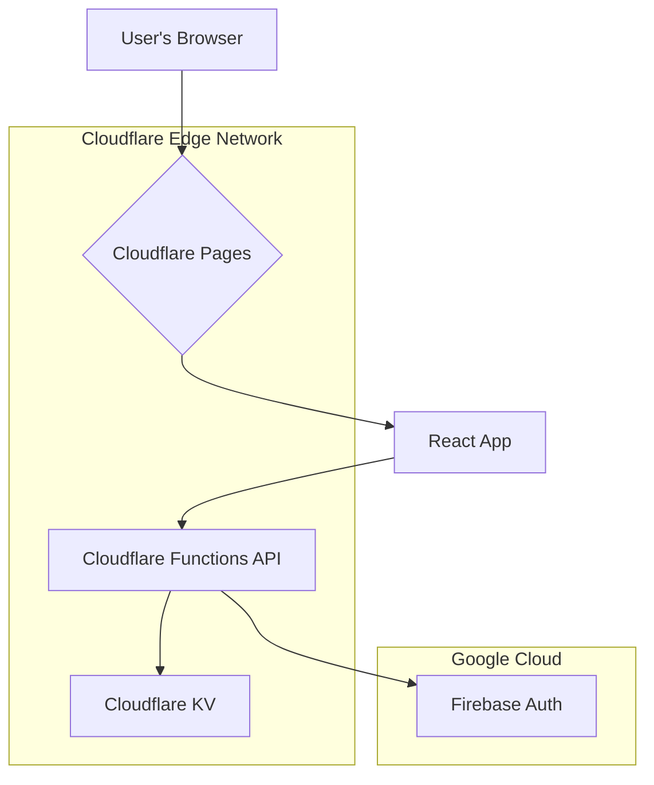

# FunelFlo Project

FunelFlo is a powerful, multi-tenant SaaS platform designed to simplify email marketing automation. It provides users with the tools to create and manage sophisticated email autoresponder campaigns, handle subscriber lists, and integrate with their preferred email sending services.

The core goal of this project is to offer a flexible and secure email marketing solution for businesses and creators. Each user or organization operates within their own isolated tenant account, ensuring data privacy. A key feature is the ability for users to securely connect their own email providers (e.g., Resend, Brevo) via encrypted API keys, giving them full control over their sending infrastructure and reputation.

Architecturally, FunnelFlow is built on a modern, high-performance, serverless-first stack. The frontend is a responsive React application (built with Vite and TypeScript), and the backend is powered by Cloudflare's edge network, utilizing Cloudflare Functions for API endpoints and Cloudflare KV for data storage. Security and scalability are paramount, with a robust authentication system built on Firebase and a secure API layer that uses JWTs and role-based access control to manage user and tenant data.

---

### Getting Started: Running Locally

To run this project on your local machine, follow these steps.

**1. Prerequisites:**
* Node.js (v20 or later)
* npm (or your preferred package manager)

**2. Installation:**
Clone the repository and install the required dependencies.

git clone [https://github.com/gremelleDev/flow-app.git](https://github.com/gremelleDev/flow-app.git)
cd flow-app
npm install

--- 

### Our Technology & Philosophy

This project is built on a specific set of modern technologies and principles. Our core philosophy is to prioritize **developer experience, user-facing performance, security, and scalability** by leveraging a serverless-first, edge-native architecture. This document explains the "what" and the "why" behind our stack, serving as a guide for all current and future development.

**Our Guiding Principles:**
* **Edge-Native**: We build and deploy on platforms that run code as close to the user as possible. This minimizes latency and improves responsiveness.
* **Serverless First**: We avoid managing traditional server infrastructure wherever possible. This reduces operational overhead and allows us to focus on building features, with automatic scaling handled by the platform.
* **End-to-End Type Safety**: We use TypeScript across the entire stack. This creates a strong contract between the frontend and backend, catches bugs at compile time, and makes the codebase more maintainable and self-documenting.

---

### Stack-at-a-Glance

| Category | Technology | Reason |
| :--- | :--- | :--- |
| **Frontend** | React, Vite, TypeScript | Modern, type-safe, component-based UI with a fast dev experience. |
| **Platform** | Cloudflare Pages & Functions| Globally fast, serverless, and scalable with integrated CI/CD. |
| **Database**| Cloudflare KV | Extremely fast edge storage for configuration and user data. |
| **Auth**| Firebase Authentication | Robust, secure, and managed identity service. |

---

### Architecture Diagram

This diagram illustrates how the components of our stack interact.

```markdown

---

### Core Technologies & Principles

#### Core Framework: React + Vite + TypeScript
* **Our Philosophy**: We use **React** for its robust component-based architecture, which allows us to build a complex, maintainable user interface. **Vite** provides an exceptionally fast and modern development experience with near-instant hot module replacement (HMR). **TypeScript** is non-negotiable; it ensures type safety from the database schema all the way to the UI components, drastically reducing runtime errors and improving collaboration.
> **Developer Takeaway**: Build small, reusable components. Fully type all props and state. Leverage TypeScript's power to ensure data contracts between components are strong.

#### Platform & Deployment: Cloudflare Pages
* **Our Philosophy**: Cloudflare Pages offers best-in-class performance by distributing our frontend globally on its edge network. Its direct integration with GitHub provides a seamless CI/CD pipeline, which powers the **Preview Deployments** mentioned in our `Development Workflow`. Every pull request gets its own live, testable environment automatically, which is invaluable for quality assurance.
> **Developer Takeaway**: Always check the preview deployment URL in a pull request before merging. Trust the integrated CI/CD process to handle builds and deployments.

#### Backend: Serverless Cloudflare Functions
* **Our Philosophy**: By writing our backend as a collection of serverless functions, we adhere to our "Serverless First" principle. These functions are lightweight, automatically scale with demand, and have extremely low latency to our frontend since they are deployed on the same edge network. We favor lean, focused functions and avoid heavy dependencies, as demonstrated by our custom, lightweight `firebase-admin-api.ts` utility.
> **Developer Takeaway**: When creating a new endpoint, keep the function's responsibility small and focused. Optimize for fast cold starts by minimizing dependencies.

#### Database: Cloudflare KV
* **Our Philosophy**: We chose KV for its unparalleled read performance, making it ideal for storing user- and tenant-specific configuration and data that needs to be accessed quickly from our edge functions. It is important to recognize that **KV is not a traditional relational database**. This architectural choice influences our `Data & Schema Migration Strategy`. We do not have access to complex queries or joins, so we must design our data structures around the specific access patterns we need.
> **Developer Takeaway**: Think about your data access patterns *before* writing to KV. Structure your keys with prefixes (e.g., `tenantId::subscriber::{subscriberId}`) to enable efficient listing and retrieval. Never attempt complex joins or queries.

#### Authentication: Firebase Authentication
* **Our Philosophy**: Authentication is a critical, complex, and solved problem. We leverage a managed service like **Firebase Auth** to handle user sign-up, sign-in, and password management securely, allowing us to focus on our application's core business logic. We use JWTs (JSON Web Tokens) issued by Firebase, and we enrich these tokens with **custom claims** (e.g., `tenantId`, `superAdmin`) to enable stateless, secure, and multi-tenant authorization in our backend API functions.
> **Developer Takeaway**: Our backend functions are secured by the `authenticate` middleware. All protected frontend API calls must use the `authedFetch` helper, which automatically attaches the user's JWT.

### Environment Variable Management
* **Our Philosophy**: A consistent and clear environment variable strategy is crucial to prevent bugs between local and deployed environments.
> **Developer Takeaway**: Our project uses two types of environment variables, distinguished by a prefix:
> * `VITE_...`: Variables prefixed with `VITE_` are for the **frontend**. They are embedded into the React application at build time and are safe to be public (e.g., Firebase public config).
> * No Prefix: Variables without a prefix are for our **backend** Cloudflare Functions (e.g., `MASTER_ENCRYPTION_KEY`, `FIREBASE_SERVICE_ACCOUNT`). These are always treated as secrets.
>
> In Cloudflare Pages, all variables must be configured for **both the Production and Preview environments** to ensure preview deployments function correctly.

---
## Development Workflow

This project follows a **Feature Branching** workflow to ensure the `main` branch remains stable and deployable at all times.

1.  **Create a New Branch**: For any new feature or bug fix, create a new, descriptive branch from the `main` branch (e.g., `feat/add-subscribers-api` or `fix/login-page-styles`).
2.  **Develop in Isolation**: All work for the feature should be done on this dedicated branch.
3.  **Open a Pull Request**: Once the feature is complete and tested, open a Pull Request to merge the feature branch back into `main`. This allows for code review and discussion before changes are integrated.
4.  **Preview Deployments**: Cloudflare Pages will automatically generate a unique preview URL for each branch/pull request, allowing us to test changes in a live environment before merging.

## Data & Schema Migration Strategy

As the application evolves, the shape of the data we store in Cloudflare KV will change. We will use the following strategies to manage these changes gracefully.

### 1. Additive Changes
For simple, non-breaking changes (like adding a new, optional field to a JSON object), the application code will be written "defensively." It will check for the existence of the new field before using it, ensuring compatibility with older data records.

### 2. Breaking Changes
For breaking changes (e.g., renaming a field or changing a data type), a more formal migration process will be used. This typically involves writing a one-time migration script (e.g., a temporary Cloudflare Function) to iterate through the database and update all records to the new schema before the new application code is deployed.

### 3. Schema Versioning
As a best practice, we will include a `schemaVersion` number inside the JSON objects we store in KV (e.g., `{ "schemaVersion": 2, ... }`). This allows our code to easily identify the format of a data record and handle it appropriately.

---

## Project Status & Roadmap

### What We've Accomplished So Far
We have successfully built a robust, secure, and well-architected foundation for the application. The groundwork for all future features is now complete.

* **Project Foundation**: We have a modern application built with React, TypeScript, and Vite, deployed on Cloudflare Pages. The backend is powered by serverless Cloudflare Functions with Cloudflare KV for the database.
* **Secure End-to-End Feature**: The "Settings" page is fully functional. It allows for managing multiple email provider configurations, and all sensitive API keys are securely encrypted at rest before being saved.
* **Robust User Authentication**: We have a complete authentication system using Firebase, including persistent user sessions and a dedicated login page.
* **Dynamic Role-Based Access Control (RBAC)**: We have a system for "super admin" users, with roles read dynamically from the user's token to control the UI.
* **Secure Backend API Pattern**: We have established a reusable and scalable pattern for our APIs by separating routing logic from business logic handlers.
* **Completed UI Polish**: We have implemented a full suite of UI and UX improvements, including a functional Logout button, a dynamic user menu, and a responsive, collapsible sidebar for mobile devices.
* **URL-Based Routing**: The application now uses `react-router-dom` for persistent, bookmarkable URLs, providing a more robust user experience.
* **Core Subscriber Management**: The first full-stack CRUD feature for Subscribers is complete and merged into `main`.
* **Core Campaign Management (CRUD)**: The foundational Create, Read, Update, and Delete functionality for Campaigns is complete.
    * We built a secure, full-featured backend API at `/api/campaigns`.
    * We implemented the `CampaignsPage` UI to display campaigns as cards and allow users to create them using a reusable modal.
* **Campaign Editor MVP Complete**: Built a complete, end-to-end feature for editing campaign email sequences. This includes a fully interactive UI for adding, deleting, and editing email steps, and the ability to persist all changes to the backend with a "Save" button. The UI has also been hardened with responsive layouts and safeguards like sequence limits.

### What We're Currently Working On
The `feat/campaign-editor` branch is now **feature-complete**. All local state management and backend persistence for the Campaign Editor are working correctly. The final step before this feature can be merged is to improve the code's long-term health.

### Immediate Next Steps
With the Campaign Editor now functionally complete, our immediate and final task for this feature is to refactor the main component to improve maintainability.

1.  **Refactor the Campaign Editor**:
    *   **Goal:** The `CampaignEditorPage.tsx` component is large and responsible for too many things. We will refactor it before merging to ensure the codebase remains clean and easy to build upon.
    *   **Plan:**
        1. Create a new `EmailSequenceList.tsx` component for the left column.
        2. Create a new `EmailEditorForm.tsx` component for the right column.
        3. The parent `CampaignEditorPage.tsx` will become a cleaner "container" component, responsible only for state management and data fetching.
2.  **Merge the `feat/campaign-editor` Branch**: Once the refactor is complete and verified, we will merge this feature into `main`.

### Big Milestones We're Aiming For
After completing and refactoring the Campaign Editor, we will continue building out the rest of the application's core functionality.

* **Subscriber Segmentation**:
    * Design and implement a system for adding tags and lists to subscribers.
    * Update the UI to allow for managing tags and filtering the subscriber list.
    * Connect campaigns to specific subscriber tags or lists.
* **UX: "Unsaved Changes" Warning**:
    * **Goal:** Prevent users from accidentally losing work by navigating away from an editor with unsaved changes.
    * **Plan:**
        1. Implement a custom hook (`useUnsavedChangesWarning`) that uses the browser's `beforeunload` event.
        2. Integrate this hook into the `CampaignEditorPage` to show a native browser confirmation dialog if `hasUnsavedChanges` is true.
* **Email Sending Engine**: Develop the core backend logic (likely using Cloudflare Cron Triggers) that will handle the scheduling and sending of all emails based on campaign rules.
* **Full Super Admin Functionality**: Build out the `TenantsPage` to allow a super admin to view and manage data for different tenants.
* **UI/UX Polish: Reusable Confirmation Modal**:
    * **Goal:** Replace all native `window.confirm()` dialogs with a consistent, reusable, and branded confirmation modal to improve the user experience for destructive actions.
    * **Plan:**
        1. Design and build a generic `ConfirmationModal.tsx` component that accepts props like `title`, `message`, and an `onConfirm` callback function.
        2. Refactor the `handleDeleteCampaign` function in `CampaignsPage.tsx` to use this new modal.
        3. Refactor the `handleDeleteSubscriber` function in `SubscribersPage.tsx` to use this new modal.
        4. Ensure this modal is used for all future destructive actions in the application.
* **Future User-Requested Features**:
    * Build a dedicated Sign-up Page to collect a user's full name.
    * Build an Account Settings/Billing Page.
